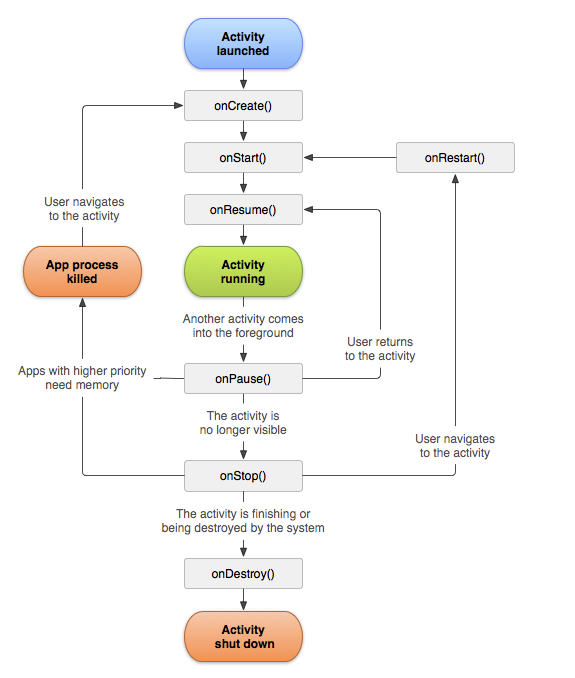
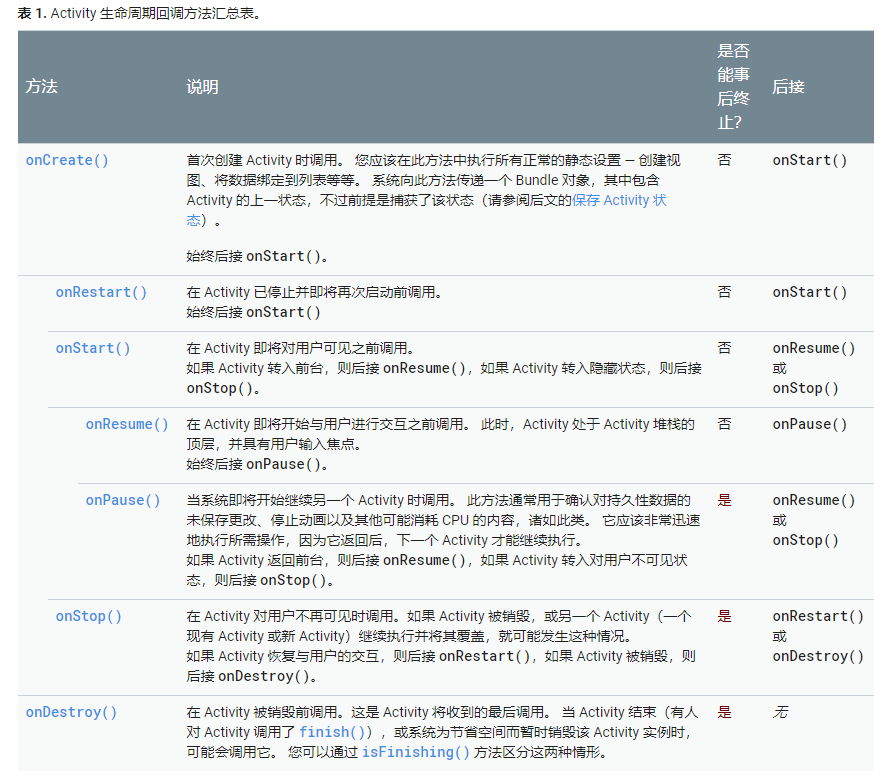

# Activity
## 定义
Activity 是Android提供的四大组件之一，是进行开发必不可少的组件。Activity 是一个界面的载体——每个Activity都会获得一个用于绘制其用户界面的窗口（组合多种控件）。用户可与其提供的窗口进行交互，以执行拨打电话、拍摄照片、发送电子邮件或查看地图等操作。

## 生命周期

### 知识点
1. 保存 Activity 状态
Activity销毁前，会先调用 onSaveInstanceState(),系统会向该方法传递一个 Bundle，我们可以在其中使用 putString() 和 putInt() 等方法以名称-值对形式保存有关 Activity 状态的信息。
重建该 Activity时，系统会将 Bundle 同时传递给 onCreate() 和 onRestoreInstanceState()。您可以使用上述任一方法从 Bundle 提取您保存的状态并恢复该 Activity 状态。

2. 当 Activity A 启动 Activity B 时一系列操作的发生顺序:
    1. Activity A 的 onPause() 方法执行。
    2. Activity B 的 onCreate()、onStart() 和 onResume() 方法依次执行。（Activity B 现在具有用户焦点。）
    3. 然后，如果 Activity A 在屏幕上不再可见，则其 onStop() 方法执行。

## 参考资料
+ [google官方文档][google_activity]

[google_activity]: https://developer.android.com/guide/components/activities
