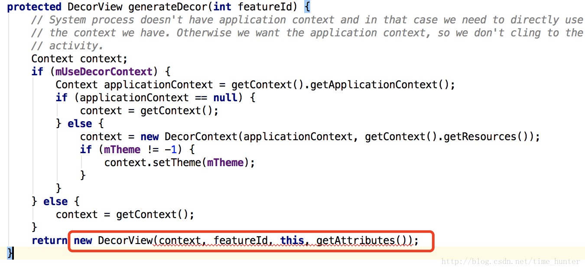

# activity的UI相关及初始化流程

## Activity的UI的层次结构

## Activity的UI 组建过程

## 关于源码
1. attach的执行

    

    attach其中的两件事
        1. 创建PhoneWindow
        2. 给当前Activity的引用传递给PhoneWindow。（当有事件发生时，可以通过这个引用传递给Activity）

2. Activity中执行setContentView
    

    getWindow执行了什么
    

    mWindow是什么?正是attach方法中新创建的PhoneWindow
    
    实际上是执行的PhoneWindow的setContentView方法

3. PhoneWindow的setContentView方法
    
    mContentParsent正是Activity main.xml的父容器
    对于非空判断，开始时，自然是空的。便会先执行installDecor来创建DecorView

4. PhoneWindow 执行setContentView时，会先创建DecorView
    
    首先创建了DecorView
    然后给mContentParent引用赋了值

5. 创建DecorView
    

6. 生成 Activity main.xml文件的父容器, mContentParent
    
    mContentParent是一个id 为 content的ViewGroup
    generateLayout

7. 要想找到mContentParent引用，还需要先将含有id 为 content的layout xml添加到DecorView，也就是DecorView的子view，mContentParent 的父容器:System layout
    
    由于示例继承自Activity。而非其他含有action bar 的Activity，此处的system layout是 R.layout.screen_simple。

    系统内置的这个screen_simple.xml是什么?
    
    可以发现，里面确实有一个id为content的ViewGroup。这正是我们需要放置main.xml的父容器
    当找到了screen_simple的layout id后，执行了DecorView.onResourcesLoaded的
    
    可以知道Decor将inflate出来的system layout作为child放到了DecorView中
    
8. 把Activity的布局添加到mContentParent中
    

此时，我们加载了View，下面需要将其添加到Window

添加到Window之后，通过ViewRootImpl.performTraversals，进行测量、布局、绘制

## 转载自[blog]
[blog]: https://blog.csdn.net/time_hunter/article/details/53858924
