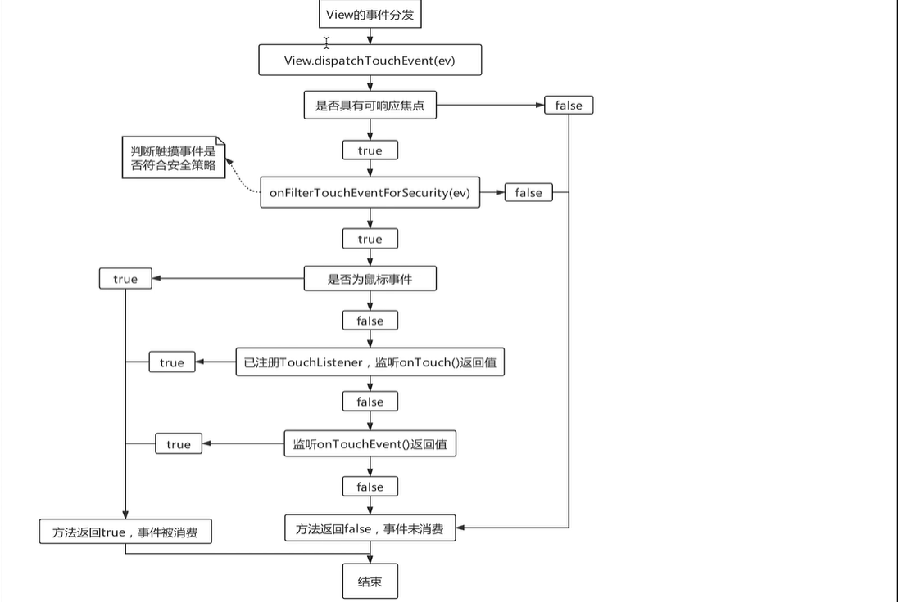

# android事件分发

>> 我们对触摸屏进行操作时，Linux就会收到相应的硬件中断，然后将中断加工成原始的输入事件并写入相应的设备节点中。而我们的Android 输入系统所做的事情概括起来说就是监控这些设备节点，当某个设备节点有数据可读时，将数据读出并进行一系列的翻译加工，然后在所有的窗口中找到合适的事件接收者，并派发给它。当点击事件产生后，事件会传递给当前的Activity，由Activity中的PhoneWindow完成，PhoneWindow再把事件处理工作交给DecorView，之后再有DecorView将事件处理工作交给ViewGroup。

## activity 事件分发
  

## ViewGroup 事件分发
  

## View 事件分发
  

####所有资料来源: [慕课网]
[慕课网]: https://www.imooc.com/learn/1155
