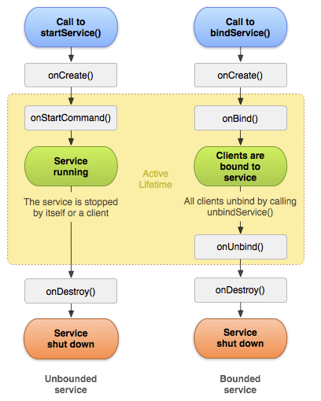

# Service
## 定义
Service 是一个可以在后台执行长时间运行操作而不提供用户界面的应用组件。服务可由其他应用组件启动，而且即使用户切换到其他应用，服务仍将在后台继续运行。 此外，组件可以绑定到服务，以与之进行交互，甚至是执行进程间通信 (IPC)。 例如，服务可以处理网络事务、播放音乐，执行文件 I/O 或与内容提供程序交互，而所有这一切均可在后台进行。

* 注意:
  服务在其托管进程的主线程中运行，它既不创建自己的线程，也不在单独的进程中运行（除非另行指定）。 这意味着，如果服务将执行任何 CPU 密集型工作或阻止性操作（例如 MP3 播放或联网），则应在服务内创建新线程来完成这项工作。通过使用单独的线程，可以降低发生“应用无响应”(ANR) 错误的风险，而应用的主线程仍可继续专注于运行用户与 Activity 之间的交互

#### 你是应该是使用线程还是服务？
简单地说，服务是一种即使用户未与应用交互也可在后台运行的组件。 因此，您应仅在必要时才创建服务。
如需在主线程外部执行工作，不过只是在用户正在与应用交互时才有此需要，则应创建新线程而非服务。

## 启动服务的两种方式


* 直接启动服务
  该服务在其他组件调用 startService() 时创建，然后无限期运行，且必须通过调用 stopSelf() 来自行停止运行。此外，其他组件也可以通过调用 stopService() 来停止服务。服务停止后，系统会将其销毁。

* 绑定服务
  该服务在另一个组件（客户端）调用 bindService() 时创建。然后，客户端通过 IBinder 接口与服务进行通信。客户端可以通过调用 unbindService() 关闭连接。多个客户端可以绑定到相同服务，而且当所有绑定全部取消后，系统即会销毁该服务。 （服务不必自行停止运行。）

## 在前台运行服务
前台服务被认为是用户主动意识到的一种服务，因此在内存不足时，系统也不会考虑将其终止。 前台服务必须为状态栏提供通知，放在“正在进行”标题下方，这意味着除非服务停止或从前台移除，否则不能清除通知。
要请求让服务运行于前台，请调用 startForeground()。此方法采用两个参数：唯一标识通知的整型数和状态栏的 Notification。

```java
Notification notification = new Notification(R.drawable.icon, getText(R.string.ticker_text),
      System.currentTimeMillis());
Intent notificationIntent = new Intent(this, ExampleActivity.class);
PendingIntent pendingIntent = PendingIntent.getActivity(this, 0, notificationIntent, 0);
notification.setLatestEventInfo(this, getText(R.string.notification_title),
      getText(R.string.notification_message), pendingIntent);
startForeground(ONGOING_NOTIFICATION_ID, notification);
```


## 代码相关
通常继承两个类来创建启动服务：
* Service
  这是适用于所有服务的基类。扩展此类时，必须创建一个用于执行所有服务工作的新线程，因为默认情况下，服务将使用应用的主线程，这会降低应用正在运行的所有 Activity 的性能。

* IntentService
  这是 Service 的子类，它使用工作线程逐一处理所有启动请求。如果您不要求服务同时处理多个请求，这是最好的选择。 您只需实现 onHandleIntent() 方法即可，该方法会接收每个启动请求的 Intent，使您能够执行后台工作。

  ## 参考资料
  [google官方文档][url_0]

  [url_0]: https://developer.android.com/guide/components/services?hl=zh-cn
